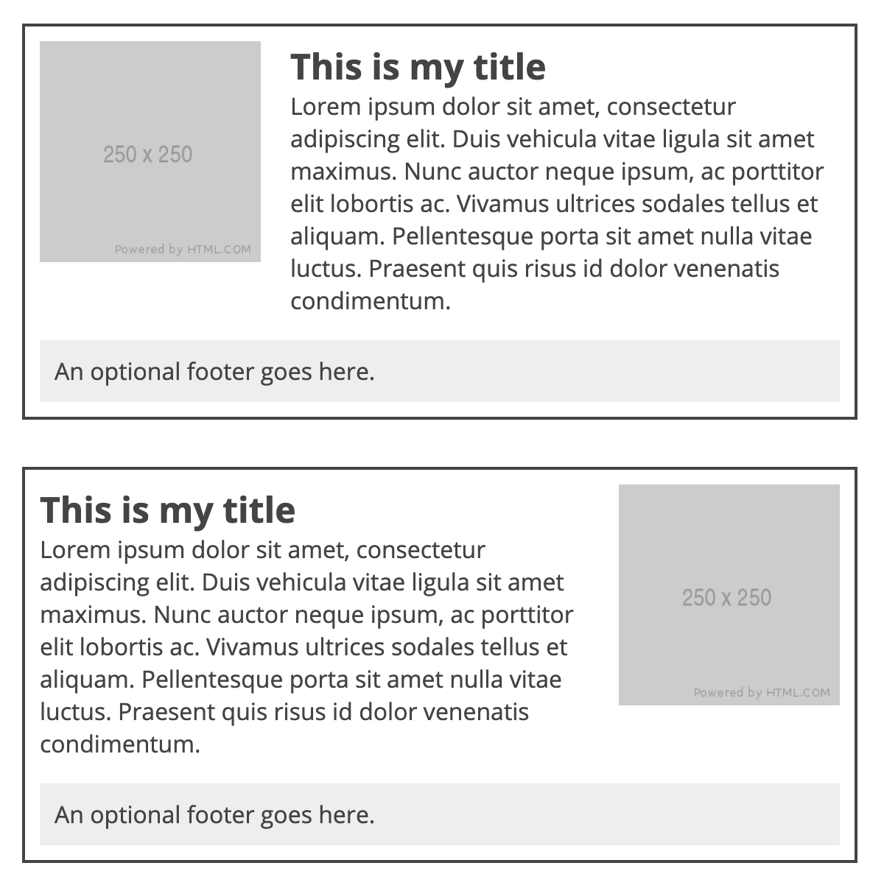

# Example 3: Graceful Grid Layouts

In combining various components of a webpage, we can use nested grids, gap settings,
and other techniques to get the right variety and precision with our designs.

## Goal
In this example we will set up a grid-based layout for the page, as well as for the 
items that are listed in the main content area. These items should have a "default"
and "alt" style so the layout is suitably varied. Images should alternate between 
right and left side of the box.

## Solution
A solution is provided in the `solution.css` file. This is provided as inspiration and is 
not the ONLY way to meet the goal. You are encouraged to experiment and find your own solution.

## Stretch Goals

* Experiment with other ways to lay out the page and items
* Use media queries to alter the way the layout appears on mobile devices

